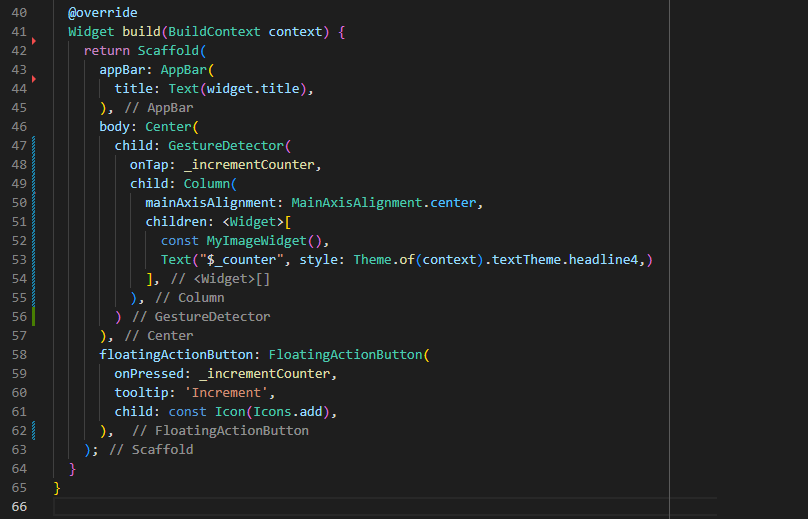
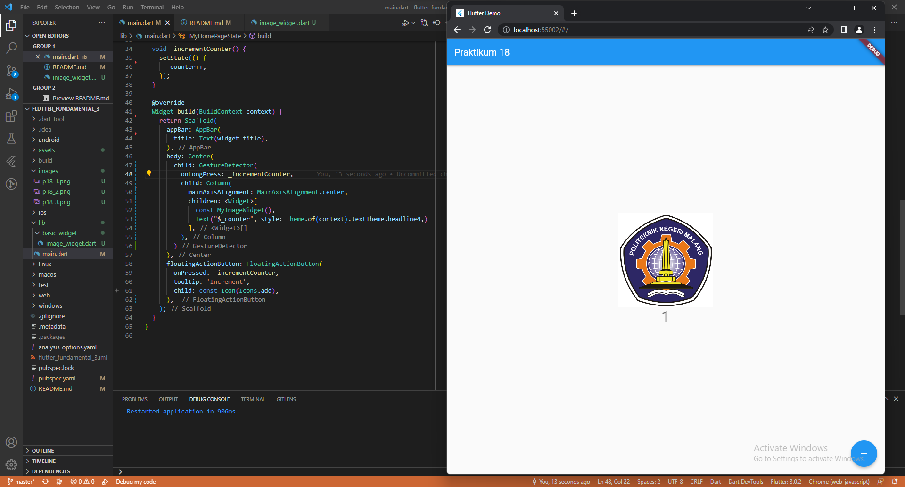
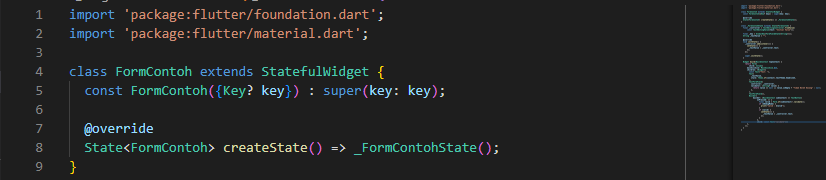
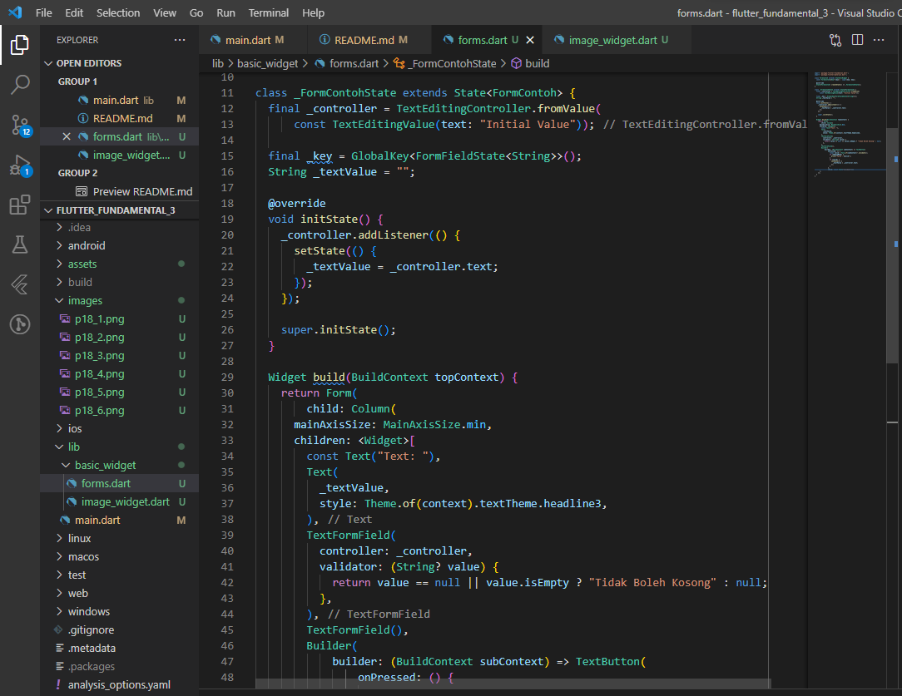
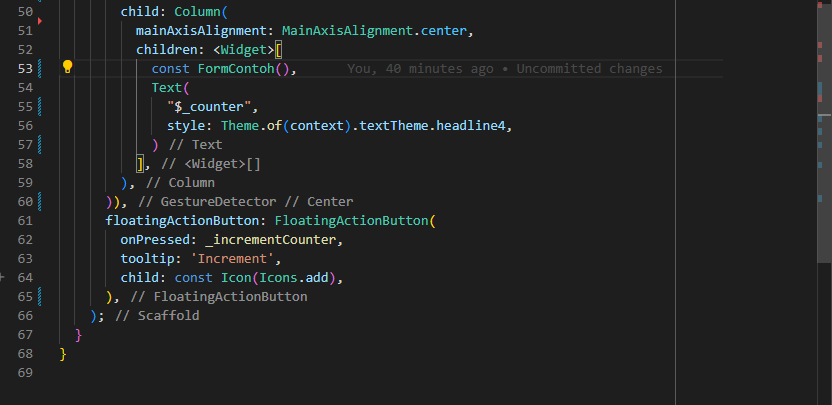
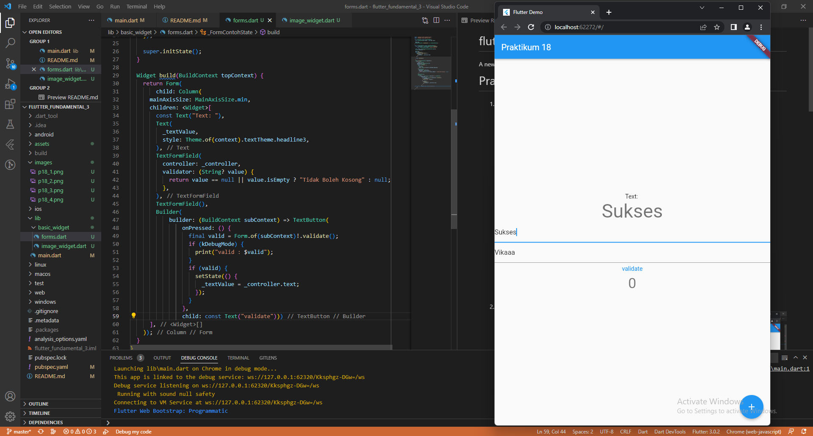

# flutter_fundamental_3

A new Flutter project.

# Praktikum 1: Menerapkan Gesture Detector

1. Menambahkan GestureDetector

2. Hasil Running

Pada praktikum kali ini menerapkan Gesture Detector. Pada program ini menampilkan logo Polinema dengan memanggil class pada MyImageWidget(). Setelah itu terdapat text yang akan menampilkan perubahan tambah angka apabila kita klik gambar tersebut karena terdapat action gesture detector. Untuk mengatur gesture detectornya terdapat onTap yang mendefinisikan apabila pengguna melakukan aksi satu ketuk pada aplikasi tersebut maka akan menghasilkan output perubahan penambahan angka. 

3. Hasil Running apabila menggunakan onDoubleTap

Pada praktikum kali ini menerapkan Gesture Detector menggunakan onDoubleTap. Pada onDoubleTap ini pengguna diharuskan untuk menerapkan aksi "Ketuk Dua Kali" supaya menghasilkan sebuah output. Kali ini output yang dihasilkan berupa perubahan pertambahan angka. Apabila pengguna menerapkan aksi hanya "Satu kali ketuk", maka program tidak akan berjalan dan tidak menghasilkan output

4. Hasil Running apabila menggunakan onLongTap

Pada praktikum kali ini menerapkan Gesture Detector menggunakan onLongTap. Pada onDoubleTap ini pengguna diharuskan untuk menerapkan aksi "Ketuk Lama" supaya menghasilkan sebuah output. Kali ini output yang dihasilkan berupa perubahan pertambahan angka. Apabila pengguna menerapkan aksi hanya "Satu kali ketuk" ataupun "Dua Kali Ketuk", maka program tidak akan berjalan dan tidak menghasilkan output

# Praktikum 2: Menerapkan Input Widget dan Forms

1. Membuat class FormContoh

2. Membuat class _FormContohState

3. Tambah widget FormContoh di main.dart

4. Hasil running

Pada praktikum kali ini menerapkan input widget dan Forms. Untuk menggunakan form kali ini menggunakan widget TextFormField. Pada form pertama hasil inputan dapat dicetak dalam aplikasi.

